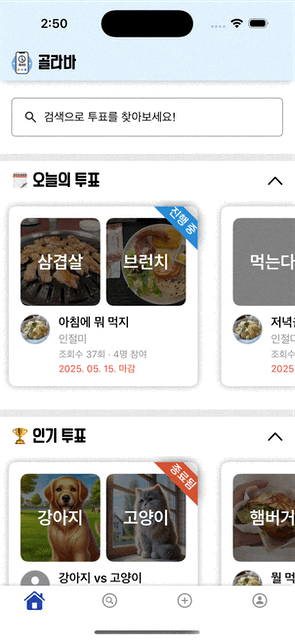
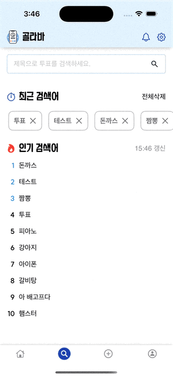
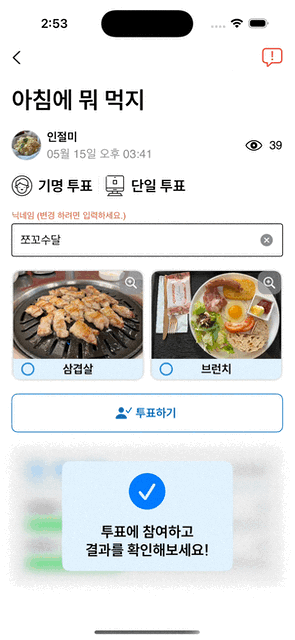
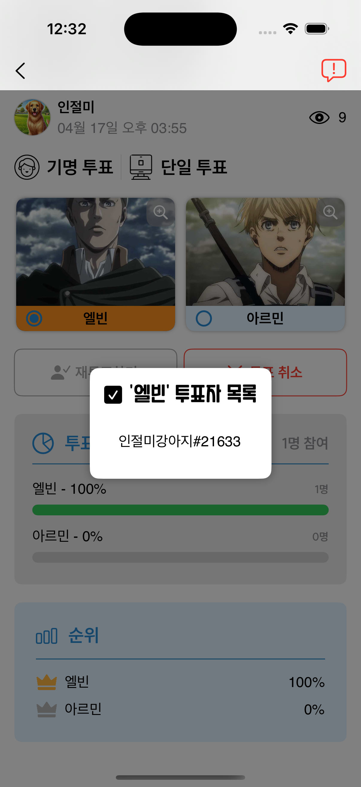
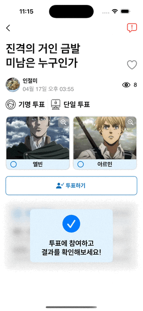
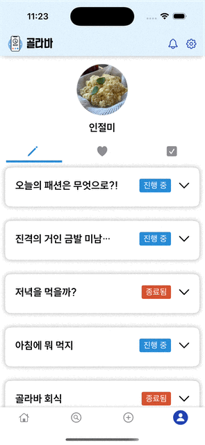
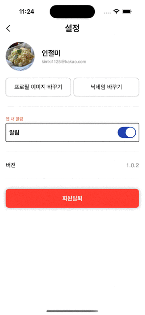
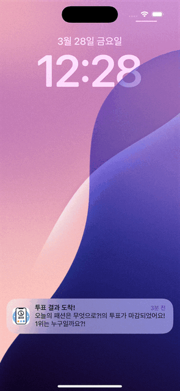
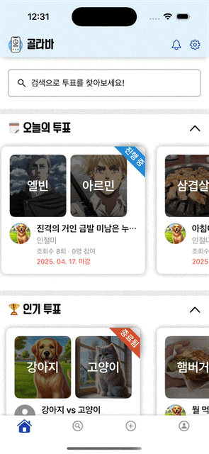
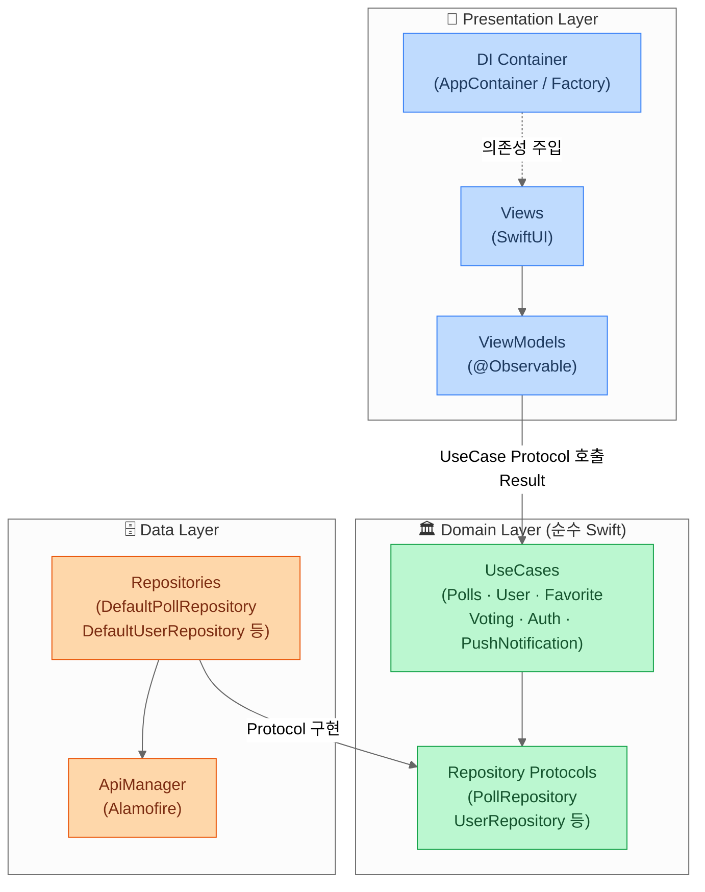

# Gollaba

> 사진 기반 투표를 만들고, 공유하고, 참여하는 iOS 소셜 투표 앱

  

 

## 스크린샷

| 홈 | 검색 | 투표 생성 |
|:---:|:---:|:---:|
|  |  |  |

| 로그인 투표 참여 | 비로그인 투표 참여 | 투표자 목록 |
|:---:|:---:|:---:|
|  |  |  |

| 좋아요 / 신고 | 마이페이지 | 프로필 수정 |
|:---:|:---:|:---:|
|  |  |  |

| 회원가입 | 푸쉬 알림 수신 | 알림 목록 |
|:---:|:---:|:---:|
|  |  |  |

 

## 주요 기능

| 기능 | 설명 |
|------|------|
| 홈 | 인기 투표, 오늘의 투표 목록 조회 |
| 투표 상세 | 투표 참여, 결과 확인, 참여 수정 및 철회, 투표자 목록 조회 |
| 투표 생성 | 항목별 이미지 첨부, 단일/복수 응답, 기명/익명 설정 |
| 검색 | 키워드 검색, 인기 검색어, 최근 검색어, 필터·정렬 |
| 마이페이지 | 내가 만든/참여한/좋아요한 투표 탭별 조회 |
| 알림 | FCM 푸시 알림 수신 및 알림 내역 조회 |
| 설정 | 프로필 이미지 변경, 닉네임 수정, 알림 on/off, 회원탈퇴 |
| 인증 | OAuth 소셜 로그인 (카카오, 애플) |

 

## 기술 스택

| 분류 | 사용 기술 |
|------|----------|
| 언어 | Swift |
| UI | SwiftUI |
| 아키텍처 | MVVM + Clean Architecture |
| 상태 관리 | @Observable |
| 비동기 | async/await |
| 네트워크 | Alamofire |
| 로컬 저장소 | SwiftData, Keychain |
| 의존성 주입 | Factory (SPM) |
| 인증 | OAuth 2.0 (카카오, 애플) |
| 푸시 알림 | Firebase Cloud Messaging (FCM) |
| 이미지 | Kingfisher |
| 테스트 | XCTest |
| UI 라이브러리 | AlertToast (CocoaPods) |

 

## 아키텍처

